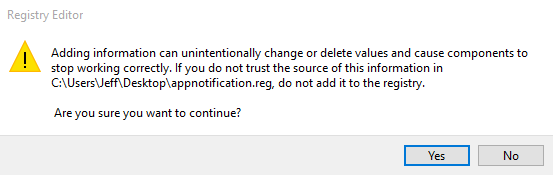

1. Download and Open the Registry Key to Import. [Click Here to Download](../assets/dl/appnotification.reg)
2. Click Yes. (See Images)
3. Shutdown and reboot your computer.

**Images:**  
2. 

<strong>Keys to Import:</strong>  
```[HKEY_CURRENT_USER\SOFTWARE\Policies\Microsoft\Windows\CurrentVersion\PushNotifications]```  
```"NoToastApplicationNotification"=dword:00000000```